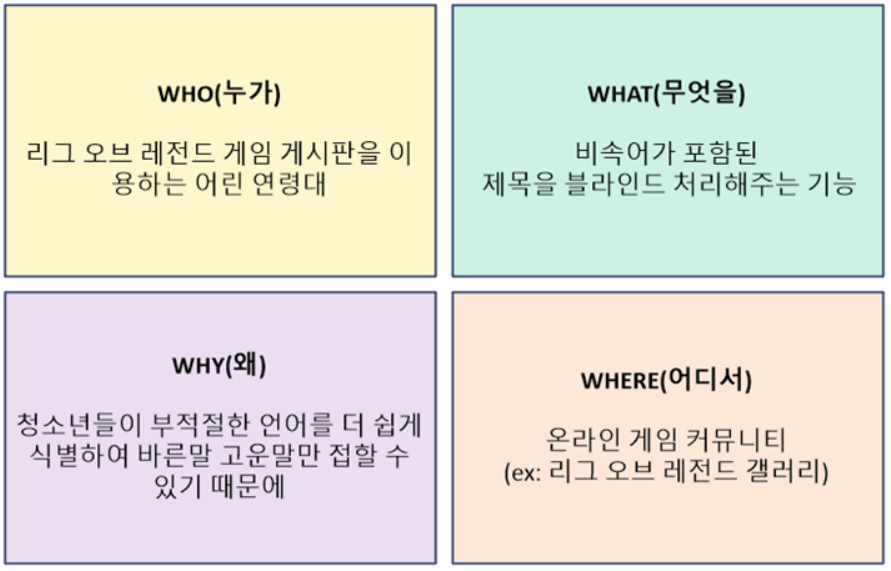
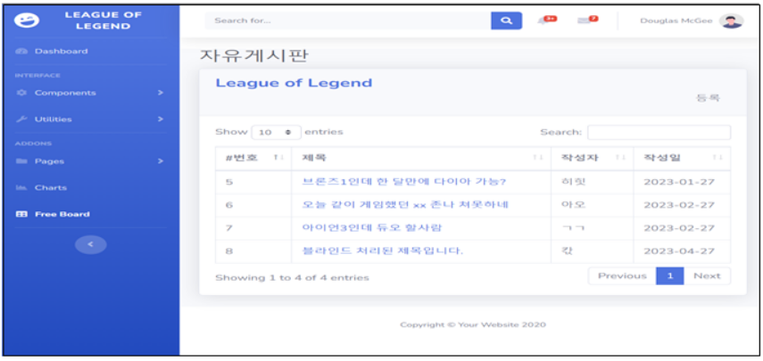
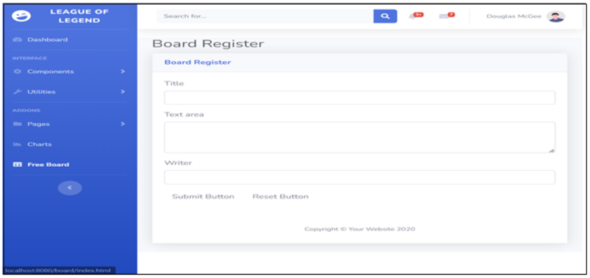
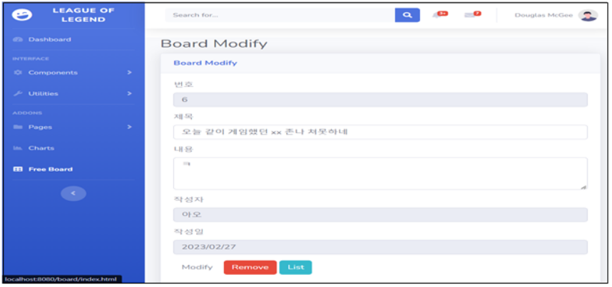
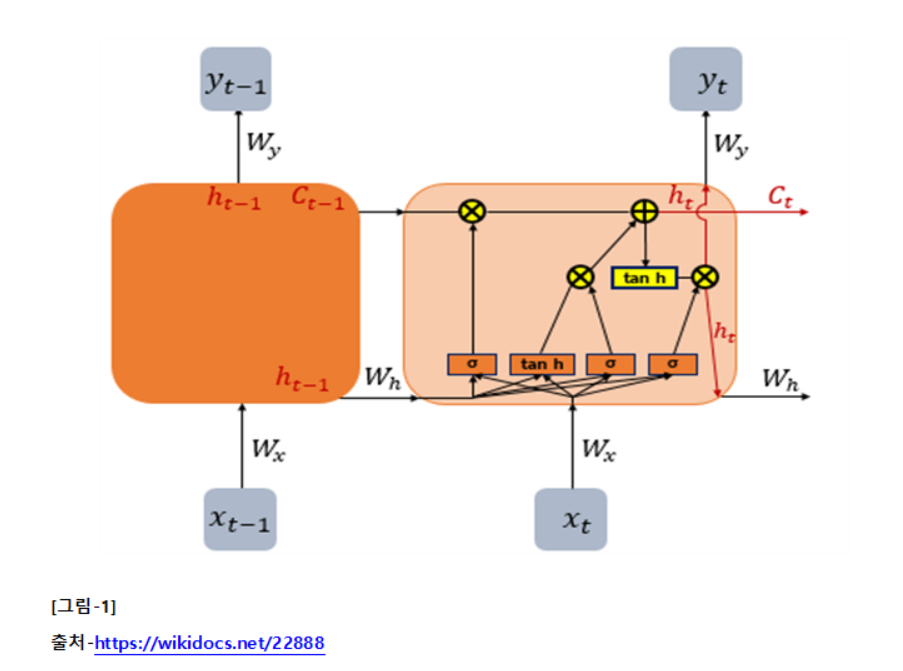
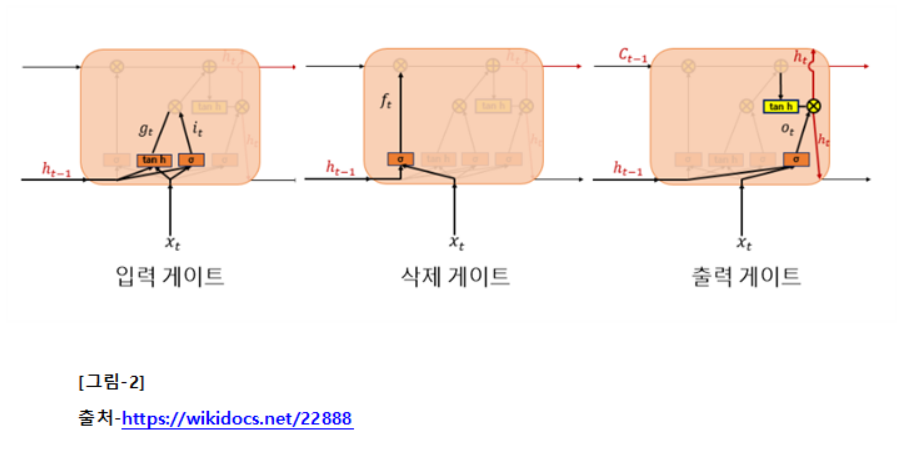
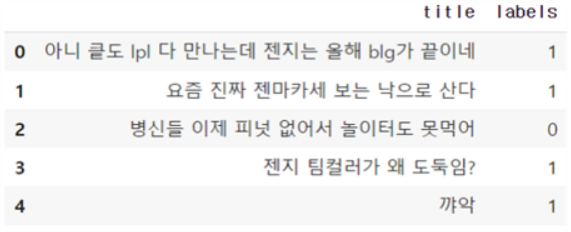
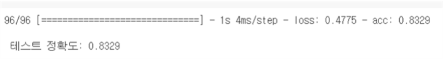
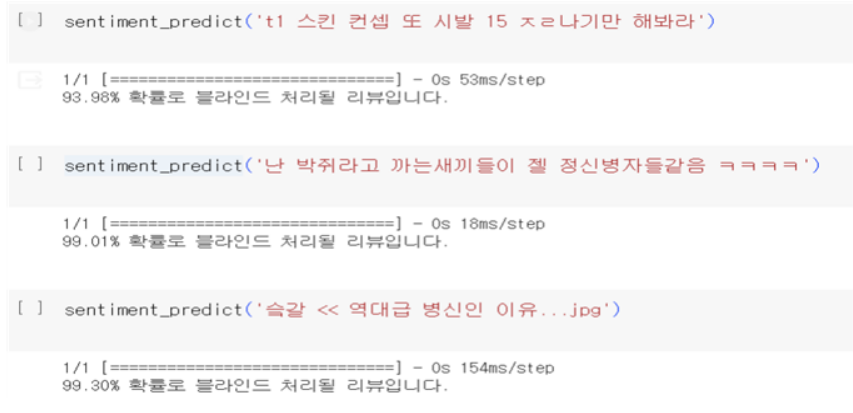

# NLP_Project

### 1. 기획서
#### A. 문제정의와 목적

#### B. 데이터 출처 및 사용
1) ‘리그 오브 레전드’ 게임의 게시판은 어린 연령대(12세 이상)의 학생들이 자주 접속하며 게시글의 제목에 욕이나 비속어가 많아 데이터 선택에 적절하다고 판단함.
2) 파이썬 코드를 사용하여 디시인사이드의 ‘리그 오브 레전드’ 게임 게시판의 제목을 크롤링 함.
3) 비속어 제목의 경우 1, 아닌 경우 0으로 레이블을 지정하여 csv파일로 변환함.

### 2. 웹 기능 명세서
#### A. UX/UI 디자인
1) 대시보드
- UI 요소: 자유게시판, 사용자 프로필 아이콘, 글 작성/수정/삭제
- UX 설계: 직관적인 대시보드로 현재 부적절한 내용이 감지된 게시물의 상태를 쉽게 확인할 수 있도록 함.
2) 부적절한 내용 표시
- UI 요소: 부적절한 욕설이 들어간 게시물 제목을 블라인드 처리
- UX 설계: 사용자가 쉽게 식별할 수 있도록 부적절한 게시물에 블라인드 처리하고, 클릭 시 성인 인증이 완료된 회원만 해당 내용을 확인할 수 있게 함.

#### B. 기능상세설명
1) 부적절한 내용 감지 기능
- 이 기능은 게시판 제목에서 욕설이나 비속어를 탐지하고 표시하는 역할을 합니다.
- 자연어 처리(NLP)를 위해 LSTM 모델을 사용하여 욕설이나 부적절한 언어의 패턴을 학습하고, 이를 기반으로 게시물의 제목을 분석하여 필터링 해줍니다.

#### C. 사용자 인터렉션
1) 게시판 리스트
- 제목에 블라인드가 표시됨

3) 게시글 작성
- 작성 시 부적절한 제목이라면 "블라인드 처리된 제목입니다"라고 처리됨

3) 게시글 수정
- 제목과 내용을 수정하거나 삭제할 수 있다.

### 3. 개발보고서
#### A. 인공지능 모델 설계
1) 사용모델설계 : LSTM(Long Short-Term Memory)
- LSTM은 RNN의 일종으로, 장기 의존성 문제를 극복하기 위해 고안된 구조를 가지고 있습니다. 이 모델은 긴 시퀀스 데이터에서 발생할 수 있는 그래디언트 소실 또는 폭발 등의 문제를 완화하면서, 시간에 따라 장기 의존성을 효과적으로 학습할 수 있습니다.
2) 모델의 구조
- LSTM은 입력 게이트, 삭제 게이트, 출력 게이트 등의 게이트를 활용하여 정보의 흐름을 제어합니다. 이러한 게이트들은 현재 입력, 이전의 은닉 상태 등을 고려하여 어떤 정보를 기억하고, 어떤 정보를 삭제할지를 결정합니다. 이 구조를 통해 모델은 장기 의존성을 효과적으로 학습하고 기억할 수 있어, 긴 텍스트에서의 의미 있는 패턴을 파악할 수 있습니다. 아래 그림1, 그림2 참조.

3) 학습방식 : Okt를 이용한 한국어 형태소 분석 및 학습
- Okt는 한국어 형태소 분석을 수행하는 라이브러리로, 텍스트를 단어 또는 형태소      단위로 분리할 수 있습니다. 프로젝트에서는 Okt를 사용하여 텍스트를 전처리하고, 분석된 형태소를 입력으로 활용하여 LSTM 모델을 학습하였습니다. 이를 통해 한국어 문장에서의 단어 간 관계와 의미를 파악하며, 부적절한 내용을 탐지할 수 있도록 훈련되었습니다.

#### B. 학습 데이터
1) 데이터 수집
- 디시인사이드 ‘리그 오브 레전드’ 갤러리에서 총 10,000개의 게시글을 크롤링하여 사용하였습니다. 초기에는 5,000개의 데이터 수집을 하였으며, 후에 추가로 크롤링하여 총 10,000개로 확장하였습니다.
2) 데이터 특성
- 수집한 데이터는 ‘리그 오브 레전드’ 갤러리에서의 다양한 주제를 다루는 게시글의 제목을 포함하고 있습니다. ‘리그 오브 레전드’ 게임과 관련된 특정 어휘, 용어, 슬랭이 반영되어 있으며, 다양한 문체와 표현이 포함되어 있습니다.
3) 데이터 레이블링
- 부정적인 제목은 0, 그렇지 않은 제목은 1을 나타내는 이진 레이블링을 진행하였습니다.

4) 텍스트 전처리
- 수집한 ‘리그 오브 레전드’ 갤러리 데이터는 텍스트 전처리를 거쳐 모델에 입력됩니다. Okt를 활용하여 한국어 형태소 분석을 수행하였습니다. 이를 통해 문장을 형태소 단위로 분해하여 모델이 더 정확하게 단어 간 관계를 이해하도록 하였습니다.

#### C. 모델평가
1) 모델학습
- 10,000개의 데이터 중 7,000개는 학습 데이터로 사용하여 훈련되었습니다. 데이터는 형태소 분석을 거친 후에 모델에 입력으로 제공되었고, 모델은 레이블링된 결과와 비교하여 가중치를 조절하며 학습되었습니다.
2) 모델테스트
- 학습된 모델은 3,000개의 테스트 데이터에 대해 성능을 평가하였습니다.
3) 평가지표
- 모델을 평가하는 주요 지표는 정확도(accuracy)로 설정하였습니다. 이는 모델이 테스트 데이터에서 얼마나 정확한 예측을 수행하는지를 나타내는 지표입니다.
4) 모델정확도
- 모델의 평가 결과, 테스트 정확도는 약 83.3%로 나타났습니다. 이는 모델이 테스트 데이터에서 83.3%의 정확도로 부적절한 제목을 감지하고 분류하는 데 성공했음을 의미합니다.

5) 학습결과 및 테스트

